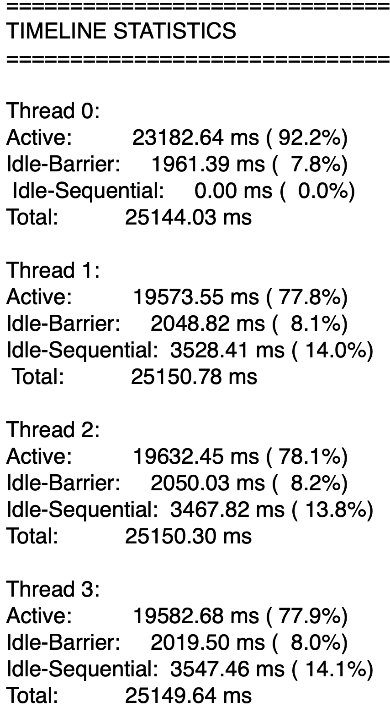
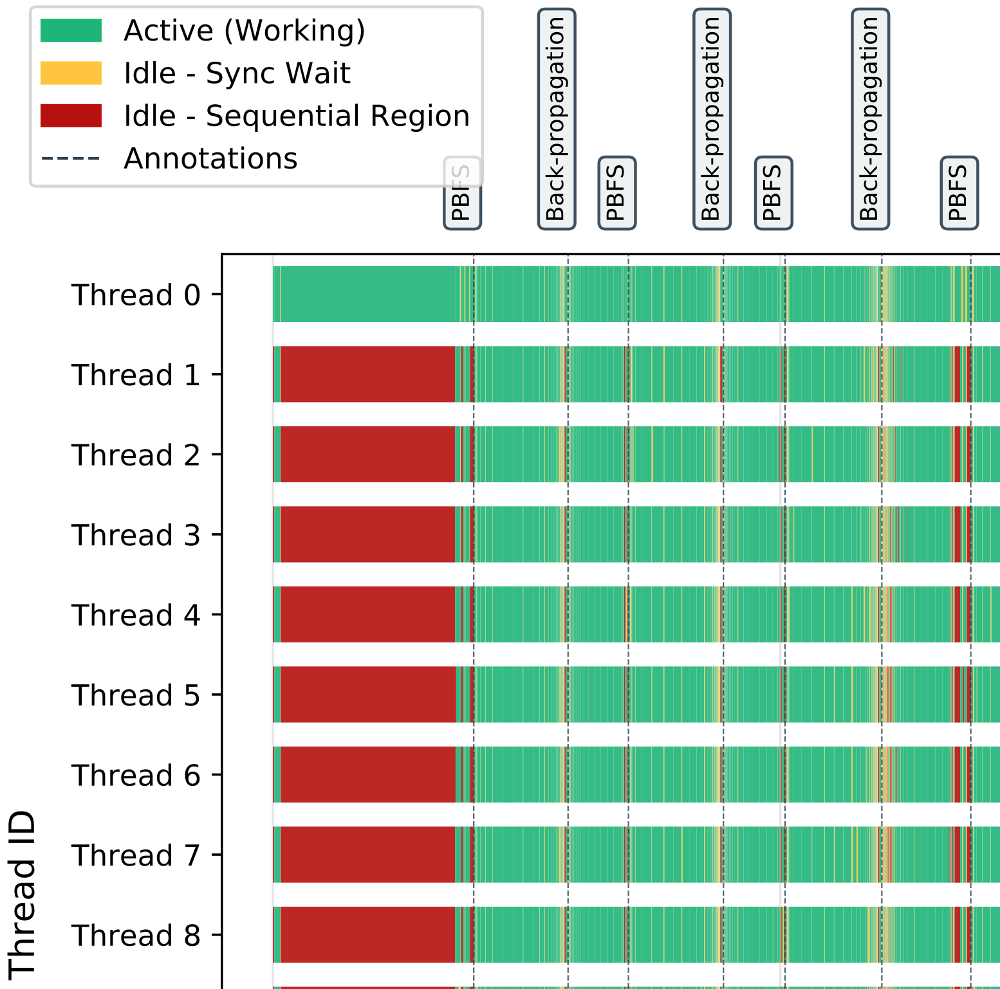

# OpenMP Runtime Visualizer
A tool for visualizing OpenMP thread runtime behavior using OMPT (OpenMP Tools Interface) hooks. This tool provides detailed insights into thread activity patterns, showing whether threads are active, idle in parallel regions, or idle in sequential regions. This tool does not rely on sampling. A sample output is shown below:

<p align="center">
	
	
</p>

## Features

- **Visual Timeline Generation**: Generate PDF timelines showing thread activity patterns
- **Detailed Analysis**: Distinguish between different types of thread idle states
- **OMPT Integration**: Built on the official OpenMP Tools Interface for accurate profiling
- **Custom Annotations**: Include `runtime_visualizer_utils.h` in your code and use the `ompt_annotate()` function to add custom annotations that will appear in the final timeline PDF

## Prerequisites

- GCC compiler
- LLVM/Clang with OpenMP support
- Python 3.x
- Required system packages:
  - `libomp-dev` (LLVM OpenMP development files)
  - `llvm-dev`

## Installation

1. **Clone the repository**:
   ```bash
   git clone https://github.com/alirezahdd/omp_runtime_visualizer.git
   cd omp_runtime_visualizer
   ```

2. **Install dependencies**:
   ```bash
   make install-deps
   ```

3. **Build the tool**:
	 ```bash
	 make
	 ```
	 This command will build the visualizer shared library (`lib/visualizer_tool.so`) and generate the environment setup script (`env_setup.sh`) in the root directory.

4. **Set up environment**:
	 ```bash
	 source env_setup.sh
	 ```
	 This command configures your environment to use LLVM's OpenMP runtime and automatically loads the visualizer tool. Make sure to run this in every new terminal session before running your OpenMP program.

## Usage

### Quick Start
1. **Prepare your OpenMP program** and compile it with OpenMP support. If you have LLVM installed with OpenMP support and you compile your program with LLVM's **clang**, you are ready to go. However, if you want to compile your code with GCC, things are a bit trickier: GCC's [libgomp does not support OMPT](https://www.openmp.org/resources/openmp-compilers-tools/#compilers), which the visualizer tool relies on. You should link GCC against LLVM's libomp. You can find the instructions on how to do this [here](docs/gcc-ompt.md).

2. **Add annotations to your source code** (optional):
   ```c
   #include "runtime_visualizer_utils.h"
   
   int main() {
       ompt_annotate("Phase 1");
       #pragma omp parallel
       {
           // Your parallel code here
       }

       ompt_annotate("Phase 2");
       #pragma omp parallel
       {
           // Your parallel code here
       }
       
       ompt_annotate("Program ends here");
       return 0;
   }
   ```
   Your annotations will appear on the threads' timelines alongside their activities.

3. **Run your program** with the visualizer tool:
   ```bash
   ./your_program > output.txt
   ```

4. **Parse the OMPT output**:
   ```bash
   python3 tools/ompt_parser.py output.txt > parsed_output.txt
   ```

5. **Generate the timeline visualization**:
   ```bash
   python3 tools/timeline_plotter.py parsed_output.txt timeline.pdf
   ```

## Output

The tool generates:
- **Raw OMPT data**: Detailed thread state transitions and timing information
- **Parsed timeline data**: Structured representation of thread activities
- **PDF timeline charts**: Visual representation showing:
	- **Thread creation and destruction**: Visualizes when threads are spawned and terminated during program execution.
	- **Parallel region entry/exit**: Shows when threads enter and leave parallel regions.
	- **Work distribution patterns**: Illustrates how work is divided among threads, highlighting load balancing and scheduling.
	- **Idle time analysis**: Identifies periods when threads are idle, either waiting in parallel regions or outside them.
	- **Custom annotations**: Displays user-defined markers added with the `ompt_annotate()` function for highlighting specific code phases.
	- **Per-thread and total activity statistics**: Summarizes activity metrics for each thread and the overall program.


